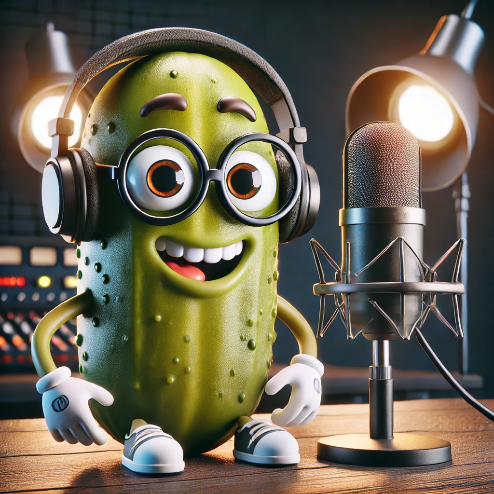

  
  </a>

   👇 Episódio #01 Do Podcast Pickle Code 👇

    <audio controls>
  <source src="./output/Episódio 01 Desvendando as Sombras do CSS e Explo.MP3" type="audio/mpeg">
</audio>

# Podcast Gerado por I.A

Projeto com o objetivo de gerar um podcast utilizando ferramentas de IA através de prompts mais trabalhado.

Utilizer uma esteira de prompts para gerar cada etapa do processo criativo.

## 💻 Tecnologias utilizadas no projeto

- [ChatGPT](https://chat.openai.com/) 
- [ElevenLabs](https://beta.elevenlabs.io/)
- [Capcut](https://www.capcut.com/pt-br/)

## ✨ Como foi feito ?

- Roteiro gerado via chatgpt
- Audio gerado pela elevenLabs
- Chatgpt Para gerar capas
- Capcut para tratar aúdio e adicionar sons de fundo

## 📚 Materiais

- [Notion Template](https://helpful-jump-17b.notion.site/PAS-Podcast-AI-Studio-210489e15d7a4a73b743bb159e45d06f?pvs=4)
- [Editor de aúdio](https://www.capcut.com/editor?from_page=landing_page&__action_from=picture_V%C3%ADdeos%20profissionais%20em%20minutos,%20n%C3%A3o%20em%20horas.)

## 🛠️ Instruções de execução

Utilize os prompts dentro do link do `Notion` fornecido na parte de `Materiais` para criar um podcast de maneira automatizada, para isso siga o passo a passo abaixo.

- 🤖 1. Use os prompts de roteiro no `chagpt`
- 🤖 2. Use os prompts de roteiro gerados pelo chatgpt no  `ElevenLabs`
- 🤖 3. Use os prompts de artes no `chatgpt`

## 👨‍💻 Dev

    
    
&nbsp&nbsp&nbspVanessa Sousa Pro 
    &nbsp&nbsp&nbsp
    <a 
        href="https://github.com/vanessasousapro">
        GitHub
    </a>
    &nbsp;|&nbsp;
    <a 
        href="https://www.linkedin.com/in/vanessa-sousa-pro/">
        LinkedIn
    </a>

  

---

⌨️ com 💜 por [Vanessa Sousa Pro](https://github.com/vanessasousapro)